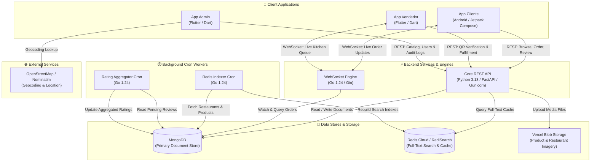
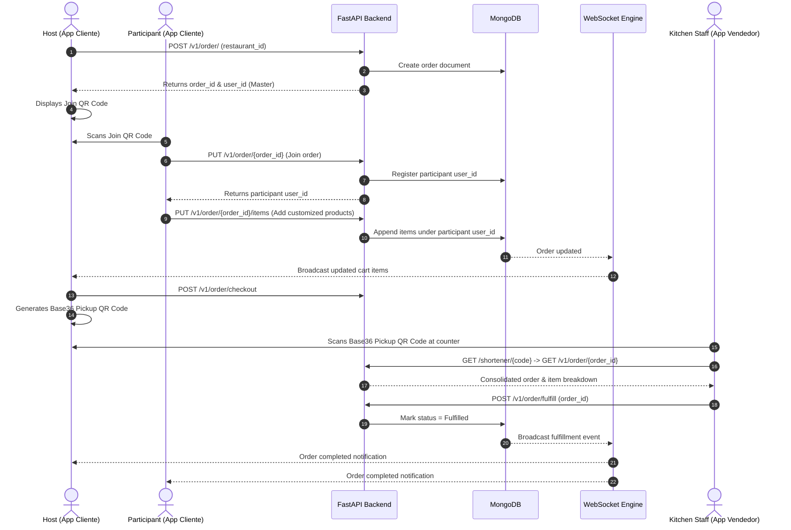

<div align="center">
  
  <h1>MiPedido</h1>
  <p>
    <a href="https://sonarcloud.io/summary/new_code?id=02loveslollipop_MiPedido">
      
    </a>
    <a href="https://sonarcloud.io/summary/new_code?id=02loveslollipop_MiPedido">
      
    </a>
    <a href="https://sonarcloud.io/summary/new_code?id=02loveslollipop_MiPedido">
      
    </a>
    <a href="https://sonarcloud.io/summary/new_code?id=02loveslollipop_MiPedido">
      
    </a>
    <a href="https://github.com/02loveslollipop/MiPedido/actions/workflows/ci.yml">
      
    </a>
  </p>
  <p><em>An integral solution for shared ordering and ahead ordering management.</em></p>
</div>

---

## 📑 Table of Contents

1. [Introduction](#-introduction)
2. [Key Features](#-key-features)
3. [System Architecture](#️-system-architecture)
4. [Application Ecosystem](#-application-ecosystem)
5. [Backend & Microservices](#️-backend--microservices)
6. [Repository Structure](#-repository-structure)
7. [Tech Stack](#️-tech-stack)
8. [Getting Started & Local Development](#-getting-started--local-development)
9. [Testing & Quality Assurance](#-testing--quality-assurance)
10. [Deployment & CI/CD](#-deployment--cicd)
11. [API Documentation](#-api-documentation)
12. [License](#-license)

---

## 📌 Introduction

**MiPedido** is a full-stack, multi-client restaurant ordering and fulfillment ecosystem designed to solve two major friction points in dining and food pickup:

1. **Collaborative / Shared Ordering**: When groups of colleagues, friends, or families dine together, ordering often leads to passing around a single phone or struggling with bill splitting. MiPedido enables a **Master** user to initiate an order session that generates a dynamic join QR code. Other users (**Slaves/Participants**) scan the QR code from their own devices to join the live session, select and customize their items, and maintain a shared cart in real time.
2. **Ahead Ordering & Rapid Counter Pickup**: Customers can place and pay for orders in advance. Orders are encoded into ultra-compact, high-density Base36 QR codes. When arriving at the counter, merchant staff scan the code with the vendor app to instantly verify the order, inspect item-by-item customization, and mark it fulfilled.

Under the hood, the system coordinates native Android and cross-platform Flutter clients with a hardened asynchronous **FastAPI** backend, a high-throughput **Go** real-time WebSocket engine, **MongoDB**, **Redis / RediSearch**, and scheduled Go background workers.

---

## ✨ Key Features

- **👥 Multi-User Shared Cart**: Real-time collaborative ordering session. Participants join via QR code, customize ingredient options, and submit selections into a single consolidated kitchen order.
- **⚡ High-Density Base36 QR Compression**: MongoDB ObjectIDs are converted into compact Base36 tokens (`timestamp-counter`) enabling fast, error-tolerant QR code scanning even under poor lighting or on budget camera sensors.
- **🔄 Real-Time Push Notifications**: Dedicated Go-based WebSocket gateway streams live order status transitions (Created, Updated, Items Added, Fulfilled) directly to customer and kitchen screens.
- **🔍 RediSearch Acceleration**: Fast full-text indexing and caching for restaurant discovery, menu catalogs, and product queries.
- **⭐ Asynchronous Rating Engine**: Offloads review calculation to an isolated Go background worker, aggregating ratings periodically without introducing latency into customer-facing order transactions.
- **🗺️ Interactive Geolocation & Mapping**: OpenStreetMap and Nominatim geocoding integration for accurate restaurant location picking and proximity discovery.
- **🛡️ Enterprise-Grade Security & Hardening**: JWT-based role authentication, strict non-root container execution (`UID 10001`), hash-pinned locked dependencies, SonarCloud A-grade security rating, and comprehensive administrative audit logging.

---

## 🏗️ System Architecture

MiPedido is structured around decoupled services communicating via REST, WebSockets, and asynchronous background pipelines:



### Collaborative Order Lifecycle



---

## 📱 Application Ecosystem

The project consists of three purpose-built frontends serving different user roles:

### 1. Customer App (`appCliente`)
- **Platform**: Native Android
- **Tech Stack**: Kotlin, Jetpack Compose, Material 3, Coroutines, StateFlow, Retrofit / OkHttp
- **Capabilities**:
  - Interactive restaurant map and proximity list.
  - Menu navigation with category filtering and product customization (ingredients, quantity).
  - Group order creation with dynamic host QR generation.
  - Camera-based QR scanner for joining active friend sessions.
  - Live order tracking screen with automatic WebSocket reconnect.
  - Interactive post-order review and rating submission.

### 2. Merchant / Kitchen App (`appVendedor`)
- **Platform**: Cross-Platform (Android / iOS / Web / Desktop)
- **Tech Stack**: Flutter, Dart, Camera QR Scanner, HTTP client
- **Capabilities**:
  - High-speed camera scanner decoding Base36 compressed pickup QR codes.
  - Consolidated order inspection grouped by product, ingredient customizations, and participants.
  - One-tap order fulfillment (`/v1/order/fulfill`).
  - Restaurant menu and product catalog overview.

### 3. Administration Dashboard (`appAdmin`)
- **Platform**: Cross-Platform (Desktop / Web / Mobile)
- **Tech Stack**: Flutter, Dart, OpenStreetMap / Nominatim API
- **Capabilities**:
  - Restaurant onboarding and editing with interactive map coordinates picker.
  - Product catalog CRUD with category assignments and image uploads via Vercel Blob.
  - User role assignment and vendor management.
  - Administrative activity monitoring and structured audit logs (`admin_logs`).

---

## ⚙️ Backend & Microservices

| Service | Directory | Language / Framework | Description |
|---|---|---|---|
| **Core REST API** | [`backend/`](backend/) | Python 3.13, FastAPI, Motor, Pydantic v2 | RESTful API managing restaurants, products, orders, users, reviews, Base36 shortener, and blob storage. |
| **WebSocket Engine** | [`webSocketEngine/`](webSocketEngine/) | Go 1.24, Gin, WebSockets | Real-time push notification gateway broadcasting order state changes to connected clients. |
| **Redis Indexer Cron** | [`redisIndexerCronJob/`](redisIndexerCronJob/) | Go 1.24, RediSearch, Mongo Go Driver | Scheduled job indexing MongoDB restaurants and menu items into Redis for fast full-text search. |
| **Rating Cron Job** | [`ratingCronJob/`](ratingCronJob/) | Go 1.24, Mongo Go Driver | Scheduled worker processing pending customer reviews and asynchronously computing restaurant ratings. |

---

## 📂 Repository Structure

```
MiPedido/
├── appCliente/                  # Native Android customer application (Kotlin + Jetpack Compose)
│   ├── app/src/main/java/       # Composable screens, view models, and API clients
│   └── build.gradle.kts         # Pinned Gradle configuration
├── appVendedor/                 # Flutter kitchen / vendor application
│   └── app_vendedor_mipedido/   # QR scanning, order fulfillment, and menu management
├── appAdmin/                    # Flutter administration portal
│   └── mipedidoadmin/           # Restaurant, catalog, user management, and audit logs
├── backend/                     # Core FastAPI application
│   ├── app.py                   # Application entrypoint and lifespan management
│   ├── database/                # Motor MongoDB connection & repositories pattern
│   ├── models/                  # Pydantic v2 data models and schemas
│   ├── routers/v1/              # API version 1 endpoint controllers
│   ├── cache/redis/             # Redis integration and RediSearch client
│   ├── tests/                   # Pytest suite with test containers / fixtures
│   ├── requirements.txt         # Runtime dependencies
│   ├── requirements.lock        # Hash-pinned locked dependencies for reproducible builds
│   └── dockerfile               # Hardened, non-root Python 3.13 production container
├── webSocketEngine/             # Real-time WebSocket server
│   ├── cmd/main/main.go         # Server entrypoint and Gin routing
│   ├── pkg/services/            # Order change watcher service
│   ├── pkg/utils/               # WebSocket hub and client managers
│   └── DockerFile               # Go Alpine container specification
├── redisIndexerCronJob/         # RediSearch background sync worker
│   ├── cmd/main/main.go         # Full-text sync pipeline (Mongo -> Redis)
│   └── Dockerfile               # One-shot container definition
├── ratingCronJob/               # Asynchronous review & rating aggregator
│   ├── cmd/main/main.go         # Rating recalculation logic
│   └── Dockerfile               # One-shot container definition
├── scripts/                     # Automation, database inspection, and CI/CD helpers
│   ├── inspect_db.py            # Diagnostic script for MongoDB collections
│   ├── create_heroku_config_from_env.py # Sync .env variables to Heroku apps
│   ├── create_heroku_scheduler_jobs.py  # Provision Heroku Scheduler cron jobs
│   └── set_github_heroku_secrets.sh     # Automate GitHub Actions secrets with gh CLI
├── docker/                      # Supplementary container templates
├── icon/                        # Project branding, icons, and vector assets
├── .github/workflows/           # GitHub Actions CI/CD pipelines
│   ├── ci.yml                   # Automated tests, linting, and workflow checks
│   ├── deploy-to-heroku.yml     # Multi-image build & deploy to Heroku Registry
│   └── set-heroku-config.yml    # Remote environment configuration workflow
├── apiDoc.md                    # Detailed REST API specification and payload examples
├── c4_model.mdj                 # StarUML C4 architectural model diagram source
├── pytest.ini                   # Async pytest configuration
└── .sonarcloud.properties       # SonarCloud analysis exclusions and quality parameters
```

---

## 🛠️ Tech Stack

- **Languages**: Python 3.13, Go 1.24, Kotlin, Dart
- **Frameworks & Libraries**:
  - Backend: FastAPI, Motor (Async MongoDB), Pydantic v2, Gunicorn, Uvicorn, PyJWT, Cryptography
  - Real-Time & Workers: Gin, Gorilla/nhooyr WebSockets, Go Redis v8, Mongo Go Driver
  - Mobile: Jetpack Compose (Material 3), Flutter SDK (Material 3)
- **Databases & Cache**:
  - MongoDB 6.0+ (Document storage)
  - Redis Cloud / RediSearch (Full-text search & caching)
  - Vercel Blob (Cloud asset storage)
- **DevOps & Infrastructure**:
  - Docker (Hardened non-root containers)
  - Heroku Container Registry & Heroku Scheduler
  - GitHub Actions CI/CD (Node 24 runner, actionlint, pytest)
  - SonarCloud (Static analysis & quality gate)

---

## 🚀 Getting Started & Local Development

### Prerequisites

- **Docker & Docker Compose**
- **Python 3.11+** or **Python 3.13**
- **Go 1.24+**
- **Flutter SDK 3.24+** (for Vendor and Admin apps)
- **Android Studio / Android SDK 34+ & JDK 17** (for Customer app)

---

### Environment Configuration

Create a `.env` file in `backend/` (or project root) based on the following template:

```env
# Application
APP_NAME=MiPedido API
DEBUG=True
LOG_LEVEL=INFO
SECRET_KEY=your_development_secret_key_here

# MongoDB
MONGODB_URL=mongodb://localhost:27017
DATABASE_NAME=mipedido

# Redis / RediSearch
REDIS_HOST=localhost
REDIS_PORT=6379
REDIS_DB=0
REDIS_PASSWORD=
REDIS_DECODE_RESPONSES=True

# Vercel Blob Storage
BLOB_READ_WRITE_TOKEN=your_vercel_blob_token_here

# Server Port
PORT=8000
```

---

### Running Core Services Locally

#### 1. Databases (Docker)

Start local MongoDB and Redis instances:

```bash
docker run -d --name mipedido-mongo -p 27017:27017 mongo:6.0
docker run -d --name mipedido-redis -p 6379:6379 redis/redis-stack:latest
```

#### 2. Backend REST API

```bash
cd backend
python3 -m venv venv
source venv/bin/activate  # On Windows: venv\Scripts\activate

# Install dependencies from hash-pinned lockfile
pip install --require-hashes -r requirements.lock

# Run development server
uvicorn app:app --reload --port 8000
```

The API will be available at `http://localhost:8000` with interactive Swagger docs at `http://localhost:8000/docs`.

#### 3. WebSocket Engine

```bash
cd webSocketEngine
go mod download
PORT=8080 MONGODB_URL=mongodb://localhost:27017 DATABASE_NAME=mipedido go run cmd/main/main.go
```

The WebSocket server will listen on `http://localhost:8080`.

#### 4. Background Workers (One-Shot Execution)

**Run Redis Indexer**:
```bash
cd redisIndexerCronJob
MONGODB_URL=mongodb://localhost:27017 DATABASE_NAME=mipedido REDIS_HOST=localhost REDIS_PORT=6379 go run cmd/main/main.go
```

**Run Rating Aggregator**:
```bash
cd ratingCronJob
MONGODB_URL=mongodb://localhost:27017 DATABASE_NAME=mipedido go run cmd/main/main.go
```

---

### Running Frontend Clients

#### Customer App (`appCliente` - Android)

Open `appCliente` in **Android Studio**, sync Gradle, and run on an Android emulator or connected device.
Alternatively, from the command line:

```bash
cd appCliente
./gradlew installDebug
```

#### Vendor App (`appVendedor` - Flutter)

```bash
cd appVendedor/app_vendedor_mipedido
flutter pub get
flutter run
```

#### Admin App (`appAdmin` - Flutter)

```bash
cd appAdmin/mipedidoadmin
flutter pub get
flutter run -d chrome  # or macos, linux, windows
```

---

## 🧪 Testing & Quality Assurance

### Automated Testing

The backend test suite verifies order creation, participant joins, item addition, catalog retrieval, and review logic using `pytest`:

```bash
# Set test environment variables
export PYTHONPATH=backend
export MONGODB_URL=mongodb://localhost:27017
export DATABASE_NAME=test_mipedido

# Run tests
pytest -q
```

### Code Quality & Security Standards

- **Locked Dependencies**: All Python dependencies are strictly pinned with cryptographic SHA256 hashes in [`backend/requirements.lock`](backend/requirements.lock) to guard against supply chain tampering.
- **Rootless Container Execution**: Production Docker images create and run as a dedicated, low-privilege system user (`appuser`, UID `10001`).
- **SonarCloud Gate**: Integrated with SonarCloud static analysis with clean code smell metrics, zero critical security vulnerabilities, and A-rated maintainability.

---

## 📦 Deployment & CI/CD

The repository includes complete GitHub Actions CI/CD workflows:

- **[`ci.yml`](.github/workflows/ci.yml)**:
  - Validates workflow files using `actionlint`.
  - Spins up an ephemeral MongoDB service container.
  - Installs locked dependencies and runs the Pytest regression test suite.
- **[`deploy-to-heroku.yml`](.github/workflows/deploy-to-heroku.yml)**:
  - Builds and releases Docker images to the Heroku Container Registry using a matrix build strategy:
    - `backend` (Web process)
    - `webSocketEngine` (Web process)
    - `redisIndexerCronJob` (Released for one-off dyno execution via Heroku Scheduler)
    - `ratingCronJob` (Released for one-off dyno execution via Heroku Scheduler)
  - Executes live smoke checks against health endpoints before finalizing deployment.
  - Implements concurrency guards to prevent race conditions during rapid commits.
- **[`set-heroku-config.yml`](.github/workflows/set-heroku-config.yml)**:
  - Automates synchronizing configuration parameters and credentials to Heroku apps.

To configure the necessary GitHub Secrets for automated Heroku deployments, use the provided helper script:

```bash
export HEROKU_API_KEY=your_api_key
export HEROKU_APP_BACKEND=mipedido-backend
export HEROKU_APP_WS=mipedido-ws
export HEROKU_APP_REDIS_INDEXER=mipedido-redis-indexer
export HEROKU_APP_RATING_CRON=mipedido-rating-cron

./scripts/set_github_heroku_secrets.sh
```

---

## 📡 API Documentation

Comprehensive REST API endpoints and schema definitions are documented in [`apiDoc.md`](apiDoc.md).

### Core Endpoint Summary

| Area | Method | Endpoint | Description |
|---|---|---|---|
| **Restaurants** | `GET` | `/v1/restaurants` | List all available restaurants |
| **Restaurants** | `GET` | `/v1/restaurants/{id}` | Get restaurant details and location |
| **Products** | `GET` | `/v1/restaurants/{id}/products` | List menu items for a restaurant |
| **Orders** | `POST` | `/v1/order/` | Create a new shared order session |
| **Orders** | `PUT` | `/v1/order/{order_id}` | Join an existing order session as a participant |
| **Orders** | `PUT` | `/v1/order/{order_id}/items` | Add or modify customized items in the order |
| **Orders** | `DELETE` | `/v1/order/{order_id}/items/{product_id}` | Remove an item from the order |
| **Orders** | `POST` | `/v1/order/fulfill` | Fulfill an order (Vendor counter pickup) |
| **Shortener** | `GET` | `/shortener/{short_code}` | Decode Base36 compressed pickup QR code to ObjectId |
| **Search** | `GET` | `/v1/search/restaurants` | Full-text query via RediSearch |
| **Reviews** | `POST` | `/v1/review` | Submit a customer review and rating |
| **WebSocket** | `WS` | `/ws/orderNotification?order_id={id}` | Real-time live order change notifications |
| **Health** | `GET` | `/health` | Service health status check |

---

## 📄 License

This project is licensed under the terms of the MIT License.
